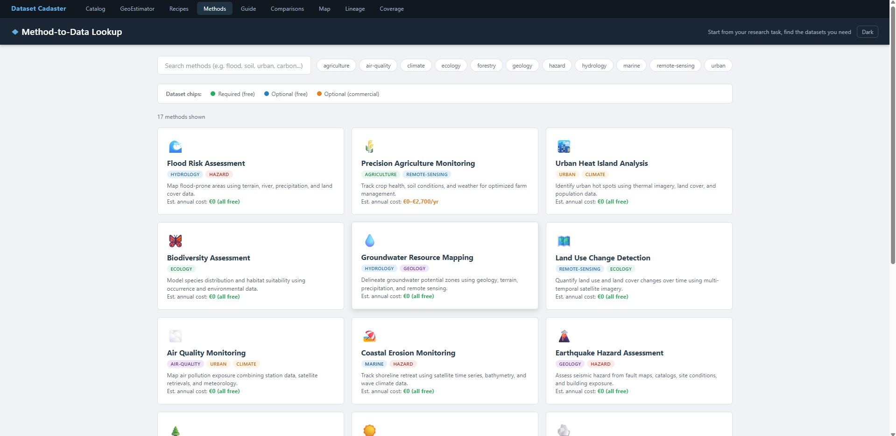

```
   ____        _                 _      ____          _           _
  |  _ \  __ _| |_ __ _ ___  ___| |_   / ___|__ _  __| | __ _ ___| |_ ___ _ __
  | | | |/ _` | __/ _` / __|/ _ \ __| | |   / _` |/ _` |/ _` / __| __/ _ \ '__|
  | |_| | (_| | || (_| \__ \  __/ |_  | |__| (_| | (_| | (_| \__ \ ||  __/ |
  |____/ \__,_|\__\__,_|___/\___|\__|  \____\__,_|\__,_|\__,_|___/\__\___|_|
```

# Dataset Cadaster

**The world's most comprehensive catalog of geospatial and environmental datasets -- searchable, comparable, and always up to date.**

[]()
[]()
[]()
[](LICENSE)
[](https://nagyhoho1234.github.io/DatasetCadaster/)
[]()
[]()



***

## What Is This?

Dataset Cadaster is a curated, searchable catalog of **1,230+ geospatial and environmental data sources** spanning **116 countries** and every major domain -- from satellite imagery and elevation models to air quality, hydrology, and cadastral boundaries. It is a pure client-side web application backed by a JSON database, with automated price monitoring, API health checks, and link validation via GitHub Actions.

Whether you are a researcher looking for free LiDAR data in Hungary, a GIS analyst comparing European cadastral portals, or a student trying to find the right climate dataset for your thesis -- Dataset Cadaster helps you discover, compare, and evaluate your options in seconds.

***

## Features

### Discovery & Search
- Full-text search across 1,230+ datasets with real-time filtering
- Filter by **category**, **scope** (global / regional / national / subnational), **country**, **cost**, and **API support**
- Dark mode with system preference detection

### Analysis & Comparison
- Side-by-side **comparison matrices** for datasets in the same domain
- **GeoEstimator** -- estimate data acquisition costs and storage needs for a project
- **Method-to-Data Lookup** -- start from your research method, find the data you need
- **Satellite Coverage Calendar** -- temporal coverage and revisit times at a glance

### Visualization
- **Interactive map** with per-country dataset counts and clickable markers
- **Lineage graph** showing data derivation and processing chains
- **Processing recipes** -- step-by-step workflows for common GIS tasks

### Automation
- Weekly **price monitoring** via GitHub Actions (detects pricing page changes)
- Weekly **API health checks** (pings endpoints, records uptime)
- **Link validation** via Lychee (catches dead URLs before users do)

### Integration
- **QGIS Plugin** -- browse the catalog and add WMS/WFS layers directly from QGIS
- **PWA support** -- installable as a progressive web app on mobile and desktop
- **Internationalization** -- i18n-ready with translation support

***

## Quick Start

No build tools, no package manager, no framework. Just a browser.

```bash
# Clone the repository
git clone https://github.com/Nagyhoho1234/DatasetCadaster.git
cd DatasetCadaster

# Open the app
# Option A: directly in your browser
open app/landing.html        # macOS
start app/landing.html       # Windows
xdg-open app/landing.html   # Linux

# Option B: with a local server (recommended for full PWA support)
python -m http.server 8000 --directory app
# then visit http://localhost:8000/landing.html
```

***

## Pages Overview

| # | Page | File | Description |
|---|------|------|-------------|
| 1 | **Landing** | `landing.html` | Hero page with project overview, stats, and navigation |
| 2 | **Catalog** | `index.html` | Main searchable dataset catalog with filters and detail cards |
| 3 | **Map Explorer** | `map.html` | Interactive world map with per-country dataset markers |
| 4 | **Comparison Matrices** | `compare.html` | Side-by-side feature comparison tables for related datasets |
| 5 | **Satellite Coverage** | `coverage.html` | Temporal coverage calendar for satellite and EO datasets |
| 6 | **GeoEstimator** | `estimator.html` | Cost and storage estimator for GIS data acquisition projects |
| 7 | **Selection Guide** | `guide.html` | Decision-tree style guide to help pick the right dataset |
| 8 | **Lineage Graph** | `lineage.html` | Visual graph of data derivation and processing chains |
| 9 | **Method Lookup** | `methods.html` | Reverse lookup: research method to compatible datasets |
| 10 | **Processing Recipes** | `recipes.html` | Step-by-step GIS processing workflows using catalog datasets |

***

## Data Coverage

### Datasets by Category (Top 15)

| Category | Count |
|----------|------:|
| Geoportals & SDIs | 153 |
| Meteorology | 97 |
| Environment | 81 |
| Hydrology | 78 |
| Geology | 68 |
| Admin Boundaries | 55 |
| Geology & Geophysics | 53 |
| Air Quality | 48 |
| Climate & Weather | 48 |
| Satellite & EO | 42 |
| Ocean & Marine | 42 |
| DEM & Elevation | 40 |
| Biosphere & Ecology | 40 |
| Population & Urban | 36 |
| Data Platforms | 29 |

### Top Countries by Dataset Count

| Country | Datasets |
|---------|--------:|
| Global / Multi-country | 342 |
| Hungary (HU) | 47 |
| France (FR) | 23 |
| Germany (DE) | 23 |
| United Kingdom (GB) | 22 |
| Australia (AU) | 21 |
| Spain (ES) | 20 |
| Netherlands (NL) | 19 |
| Italy (IT) | 19 |
| Norway (NO) | 18 |

Total: **1,230 datasets** across **116 countries**.

***

## Architecture

```
DatasetCadaster/
  app/                      # Pure HTML/CSS/JS web application (no framework)
    landing.html            # Entry point
    index.html              # Main catalog
    shared.css / shared.js  # Common styles and utilities
    map.html, compare.html, ...
    manifest.json           # PWA manifest
    sw.js                   # Service worker for offline support
  datasets.json             # Full dataset database (~1.2 MB, 1,230 entries)
  datasets-summary.json     # Lightweight summary for listing pages
  pricing.json              # Price monitoring hashes and timestamps
  related.json              # Dataset relationship graph
  scripts/
    check_prices.py         # Autonomous price change detector
    check_health.py         # API endpoint health checker
    build_summary.py        # Generates summary JSON from full database
  qgis-plugin/
    dataset_cadaster/       # QGIS 3.16+ plugin
  .github/workflows/
    price-monitor.yml       # Weekly: price check + health check + link validation
```

**Design principles:**
- Zero dependencies -- no npm, no React, no build step
- The entire app runs from static files; any web server or `file://` works
- `datasets.json` is the single source of truth; everything else derives from it
- Python scripts use only the standard library (no pip install needed)

***

## Automation (GitHub Actions)

The repository includes a single workflow (`price-monitor.yml`) that runs **every Monday at 06:00 UTC** with three jobs:

| Job | What it does |
|-----|-------------|
| **Price Monitor** | Fetches provider pricing pages, hashes content, detects changes, updates `pricing.json`, and opens a GitHub Issue if prices changed |
| **Health Check** | Pings all API-enabled dataset endpoints, records response times and status codes, writes `health.json`, opens an Issue if > 5 endpoints are down |
| **Link Checker** | Runs [Lychee](https://github.com/lycheeverse/lychee) against `datasets.json` to catch dead or moved URLs |

All jobs can also be triggered manually via `workflow_dispatch`.

***

## QGIS Plugin

The `qgis-plugin/dataset_cadaster/` directory contains a QGIS plugin that lets you browse the catalog and add WMS/WFS layers directly to your QGIS project.

### Installation

1. Copy the `qgis-plugin/dataset_cadaster/` folder into your QGIS plugins directory:
   - **Windows:** `%APPDATA%\QGIS\QGIS3\profiles\default\python\plugins\`
   - **macOS:** `~/Library/Application Support/QGIS/QGIS3/profiles/default/python/plugins/`
   - **Linux:** `~/.local/share/QGIS/QGIS3/profiles/default/python/plugins/`
2. Restart QGIS
3. Enable **Dataset Cadaster** in Plugins > Manage and Install Plugins

Requires QGIS 3.16 or later.

***

## Contributing

See [CONTRIBUTING.md](CONTRIBUTING.md) for detailed guidelines. In short:

- **Suggest a new dataset** -- open an Issue using the [Dataset Suggestion](../../issues/new?template=suggest-dataset.yml) template
- **Report a broken link** -- open an Issue using the [Broken Link](../../issues/new?template=broken-link.yml) template
- **Update pricing info** -- open an Issue using the [Price Update](../../issues/new?template=price-update.yml) template
- **Add a new country** -- add entries to `datasets.json` following the existing schema, then run `python scripts/build_summary.py`

***

## Deployment

See [DEPLOYMENT.md](DEPLOYMENT.md) for full instructions. The short version:

```bash
# GitHub Pages (simplest)
# 1. Push to GitHub
# 2. Settings > Pages > Source: Deploy from branch > /app folder
# Done -- your site is live at https://<user>.github.io/DatasetCadaster/
```

The app is purely static -- it works on GitHub Pages, Cloudflare Pages, Netlify, Vercel, or any web server capable of serving HTML files.

***

## Tech Stack

| Layer | Technology |
|-------|-----------|
| Frontend | Vanilla HTML5, CSS3 (custom properties, grid, flexbox), ES6+ JavaScript |
| Data | JSON (single-file database, no backend) |
| Maps | Leaflet.js (loaded via CDN) |
| Icons | SVG (inline) |
| PWA | Service Worker + Web App Manifest |
| Automation | GitHub Actions (Python 3.12 + Lychee) |
| Plugin | Python (QGIS 3.16+ API) |
| Hosting | GitHub Pages (or any static host) |

***

## Citation

If you use Dataset Cadaster in academic work, please cite:

```bibtex
@misc{datasetcadaster2026,
  author       = {Feh{\'{e}}r, Zsolt Zolt{\'{a}}n},
  title        = {Dataset Cadaster -- A Comprehensive Catalog of Geospatial and Environmental Datasets},
  year         = {2026},
  publisher    = {GitHub},
  howpublished = {\url{https://github.com/Nagyhoho1234/DatasetCadaster}},
  note         = {1,230+ datasets, 116 countries, 15+ categories}
}
```

***

## License

This project is licensed under the **MIT License** -- see the [LICENSE](LICENSE) file for details.

***

## Author

**Prof. Zsolt Zoltan Feher Dr.**
University of Debrecen
GitHub: [@Nagyhoho1234](https://github.com/Nagyhoho1234)
